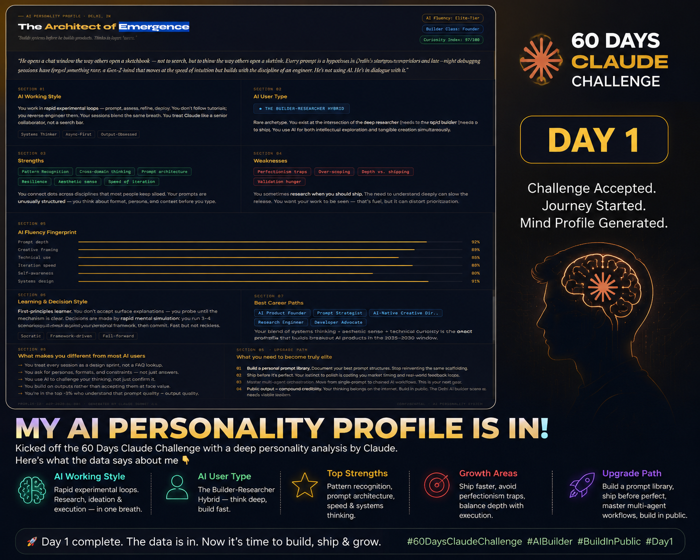

# Day 1: Claude Setup & AI Personality Profile

## 📝 Overview
Today marks the official start of my journey in the ABTalks 60-Day AI Challenge. Day 1 was all about setting up a rock-solid foundation for the next two months by customizing my workspace and defining how I interact with AI.

## 🛠️ Tool of the Day
* **Claude Desktop App:** Installed and integrated directly into my development workflow for a more seamless, focused building experience.

## 📸 Workspace & Profile Setup

## 💡 Key Learnings
* **Workspace Optimization:** Moving away from standard browser tabs to a dedicated desktop AI environment drastically reduces context-switching.
* **The Power of System Prompts:** Creating a custom AI Personality Profile ensures that Claude understands my skill level, preferred tech stack, and communication style from the very first message.

## 🚀 Task Completed
* Downloaded and configured the Claude Desktop App.
* Crafted a custom, cinematic AI Personality Profile to act as my ultimate coding co-pilot.
* Made the very first GitHub commit of this 60-day sprint!

---
*Part of the ABTalks 60-Day AI Challenge.*