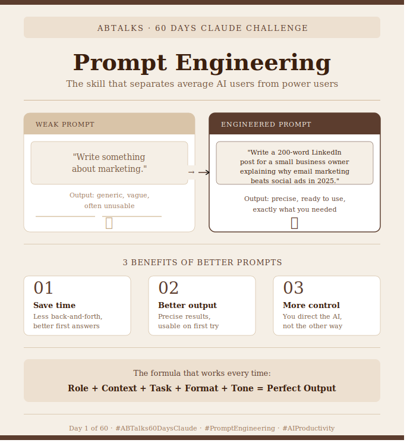

# Day 2: What Is Prompt Engineering?

## 📝 Overview
Today, I shifted from just "chatting" with AI to truly engineering the way I communicate with it. I explored the core principles of Prompt Engineering to understand how to guide AI into generating precise, production-grade outputs.

## 🛠️ Tool of the Day
* **MetaPrompt:** Used this powerful utility/framework to structurally optimize prompts, ensuring consistent, predictable, and high-quality results.

## 📸 Before vs After Optimization

## 💡 Key Learnings
* **Clarity & Structure:** AI yields the best results when given explicit instructions, structural boundaries, and a clearly defined persona.
* **Role Prompting:** Assigning a specific expert role (e.g., Senior Full-Stack Developer) drastically improves context and code relevance.
* **Context over Ambiguity:** Providing constraints (what *not* to do) is just as important as providing the instructions themselves.

## 🚀 Task Completed
* Mastered the fundamentals of prompt structure and design.
* Built and refined prompt templates using **MetaPrompt**.
* Documented the dramatic quality difference between a basic "before" prompt and a structurally engineered "after" prompt.

---
*Part of the ABTalks 60-Day AI Challenge.*